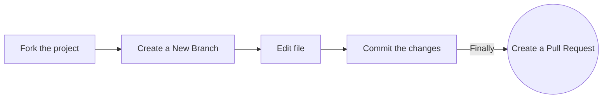
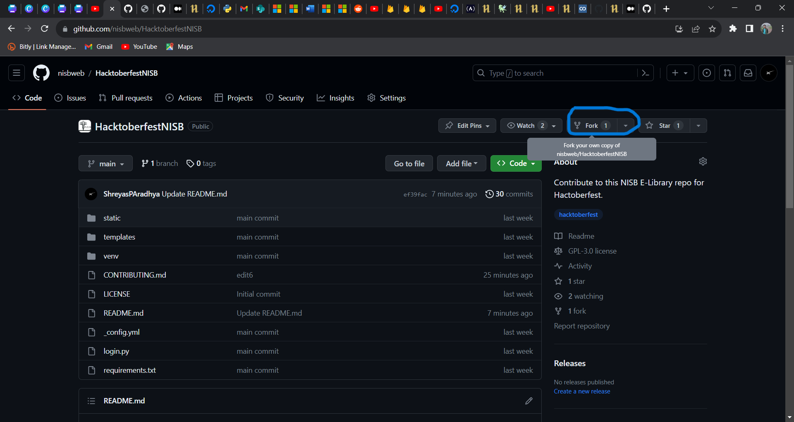
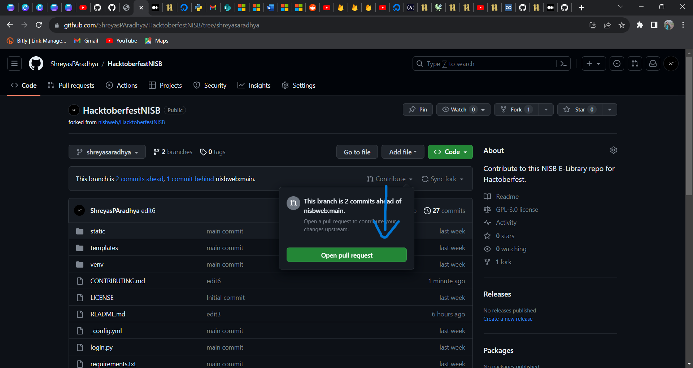

# 🔥Hacktoberfest 2023 X NIE IEEE Student Branch🔥
### ⭐Star this repo to start your journey⭐.


## What is Hacktoberfest? :computer:
Hacktoberfest is DigitalOcean’s annual event that encourages people to contribute to open source throughout October. Much of modern tech infrastructure—including some of DigitalOcean’s own products—relies on open-source projects built and maintained by passionate people who often don’t have the staff or budgets to do much more than keep the project alive. Hacktoberfest is all about giving back to those projects, sharpening skills.

## What is OpenSource?📖
Opensource is a [source code](https://en.wikipedia.org/wiki/Source_code) that is made freely available for possible modification and redistribution. This includes permission to use the source code, design documents, or content. The open-source model is a decentralized software development model that encourages open collaboration. A main principle of open-source software development is peer production, with products such as source code, blueprints, and documentation freely available to the public. The open-source movement in software began as a response to the limitations of [proprietary code](https://en.wikipedia.org/wiki/Proprietary_software).

## Guidelines🚀
Register for the fest [here](https://hacktoberfest.com/) and send a minimum of 4 pull requests from oct 1st to oct 31st and win goodies like stickers, digitalbadges and many more exciting gifts.
This year, trees will be planted in the name of first 50k participants who complete the challenge.    
-Refer to the instructions below ⬇️ and sned 4 or more pull requests.   
-The pull requests can have very simple things like adding comments to the code, making it more readable, adding guidlines etc... and advanced things like creating a database, writing the backend code and modying the frontend. Refer to the last part of the page for advanced contributions.   

# Instructions on how to contribute to Hacktoberfest.

## Step 0:
-Create a github account ([Here](https://github.com/))   
-Install git on your system.    
-Register for [Hacktoberfest](https://hacktoberfest.com/).

## Step 1 - FORK:


Fork the repository to your GitHub account.


## Step 2 - CLONE:
Clone(download) it to your local machine.   
`use this command`
```sh
$ git clone https://github.com/Your_Username/HacktoberfestNISB.git
```
-This will create a local copy of the repository in your machine.
-move to this folder for the next steps(current working directory).

## Step 3 - Creating referance⏫
Add a reference to the original HacktoberfestNISB (NISB)repository using the below command (Remember that you are currently working on the repository forked to your account, it is necessary that you create a link to the main NISB repository).
```sh
$ git remote add upstream https://github.com/nisbweb/HacktoberfestNISB.git
```
`This adds new remotes named upstream.`    
To check - use
```sh
$ git remote -v
```
You should get
```sh
origin    https://github.com/Your_Username/HacktoberfestNISB.git (fetch)
origin    https://github.com/Your_Username/HacktoberfestNISB.git (push)
upstream  https://github.com/Remote_Username/HacktoberfestNISB.git (fetch)
upstream  https://github.com/Remote_Username/HacktoberfestNISB.git (push)
```

## Step 4: Keep it updated!♻️
Make sure that your local copy is always updated with the original repository.   
use
```sh
$ git pull upstream main
```
## Step 5 :arrow_down:
Now you are ready to update your contribution by sending a PR !!!.    
-First create a branch and add all your files to it.   
1.
```sh
# Create a new branch with name branch_Name
$ git checkout -b BranchName
```   
2.
```sh
# To switch to that branch
$ git checkout BranchName
```   
3.
```sh
# To add all files to the branch 
$ git add .    
# commit the changes
$ git commit -m "your-name"
```   

At the end, push the work you have done to your remote repository using
```sh
# Push your work to your remote repository
$ git push origin <branchName>
```

## Step 6
Now go to your repository in the browser and click on contribute > Open pull request.
Then add a title, explain in brief what you have done and send the PR!.



## Thats it, wait for us to merge your PR and then you will get a +1 in the hacktoberfest website :fire::fire:

# Happy Coding👋 

## For advanced contributions, refer below :arrow_down:

### The expectation, as given is an E-Library website with proper backend. Refer to the wireframe doc attached for the required end result.
### there arent any restrictions on any change. Keep a thumbnail for the books and other sections where pictures are needed
### Hyperlinks and nav for every book or uploads is expected
### Any database system can be used(MySQL,MongoDB,Firebase etc), but the dbms first pushed into the repo will be considered and others will have to work on that same database itself.
### Authentication is done using Firebase (you can ping us for any info on the credentials or to edit the firbase settings). There is a requirement to create users and presonalised login for every user.(Currently an example login with 1 user is made).(A user stack to is required)

